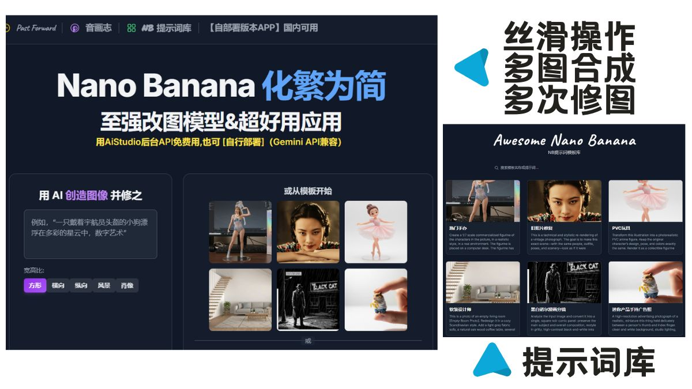

# free-image - AI 图片编辑器

free-image 是一款功能强大的网页版 AI 照片编辑器，利用 Google Gemini 的先进能力，让专业级的图像编辑和创作变得简单直观。用户可以通过简单的文本提示对图像进行修饰、应用创意滤镜、进行专业调整，甚至从零开始生成全新的图像。



## ✨ 主要功能

free-image 结合了多种尖端 AI 能力，为您提供一站式的创意图片与视频解决方案：

-   **🚀 AI 图像生成**: 输入任意文本描述，即可由 `Imagen 4` 模型创造出细节丰富、富有创意的高质量图片，并支持多种宽高比。
-   **✍️ 智能修饰 (局部编辑)**: 在图片上轻松点击指定位置，通过简单的文字指令（如“移除这个物体”、“把衬衫变成红色”）进行精准、无缝的局部修改。
-   **🎨 创意滤镜与专业调整**: 一键应用动漫、合成波、Lomo 等多种艺术风格滤镜，或进行背景虚化、增强细节、调整光效等专业级图像调整。
-   **💡 AI 灵感建议**: 不确定从何下手？AI 会智能分析您的图片，并为您量身推荐最合适的滤镜、调整和纹理效果，激发您的创作灵感。
-   **🧩 智能合成**: 上传多张图片，通过一句话描述，即可将不同元素（如人物、背景、风格）无缝地融合在一起，创造出全新的合成图像。
-   **🧱 纹理叠加**: 为图片添加各种逼真的创意纹理，如裂纹漆、木纹、金属拉丝等，瞬间提升画面质感。
-   **✂️ 一键抠图**: 强大的人工智能可自动识别并移除图片背景，一键生成带透明通道的 PNG 图像，非常适合设计和合成。
-   **🕰️ Past Forward (时空穿越)**: 上传一张肖像照，AI 将带您穿越时空，生成您在 1950s 至 2000s 各个年代的逼真样貌。
-   **🎵 音画志 (BeatSync)**: 上传一张图片和一段音乐，AI 会自动生成多种风格化图集，并根据音乐节拍一键生成带有酷炫转场效果的视频短片。
-   **📚 提示词库**: 内置一个可搜索、分页的模板库，提供丰富的创意起点。点击模板即可加载预设图片和提示词，轻松开始您的创作之旅。
-   **🛠️ 基础编辑套件**: 提供无限制的裁剪、撤销/重做、实时对比原图、保存和下载等基础功能，满足您的日常编辑需求。

## 🚀 安装与部署

本项目是一个无需构建步骤的纯静态应用，可以轻松部署在任何支持静态文件的托管服务上。

### 准备工作

您需要一个 Google Gemini API 密钥。您可以从 [Google AI Studio](https://makersuite.google.com/app/apikey) 获取。

### 本地运行

1.  **克隆仓库**

2.  **配置环境变量**
    复制示例环境变量文件：
    ```bash
    cp .env.example .env
    ```
    打开 `.env` 文件并填入您的 API 密钥：
    ```env
    # 必需：您的 Google Gemini API 密钥
    API_KEY="在此处粘贴您的密钥"
    ```
    **注意**: 应用允许用户在网页的“设置”中覆盖此环境变量。

3.  **启动本地服务器**
    由于这是一个静态项目，您可以使用任何简单的 HTTP 服务器来运行它。例如，如果您安装了 Python：
    ```bash
    python -m http.server
    ```
    或者使用 Node.js 的 `serve` 包：
    ```bash
    npx serve .
    ```
    然后在浏览器中打开提供的地址 (例如 `http://localhost:8000`)。

### 部署到 Vercel 或 Netlify

1.  **Fork 本仓库** 或将其推送到您自己的 GitHub/GitLab/Bitbucket 账户。

2.  **在托管平台创建新项目**
    -   登录到 Vercel、Netlify 或其他类似的平台。
    -   创建一个新项目/站点，并将其连接到您刚才创建的仓库。

3.  **配置构建设置**
    平台通常会自动检测。如果没有，请使用以下设置：
    -   **构建命令**: (留空)
    -   **发布目录**: (留空或设置为项目根目录)
    -   **安装命令**: (留空)

4.  **设置环境变量**
    -   在平台的项目设置中，找到“Environment Variables”（环境变量）部分。
    -   添加一个名为 `API_KEY` 的变量，并将其值设置为您的 Google Gemini API 密钥。

5.  **部署**
    保存设置并触发部署。部署完成后，您就可以通过平台提供的 URL 访问您的应用了。

## 🛠️ 技术栈

- **前端**: React 19 (通过 esm.sh 加载，无构建步骤)
- **语言**: TypeScript
- **AI 模型**: Google Gemini API (`gemini-3-pro-image-preview`, `imagen-4.0-generate-001`, `gemini-2.5-flash`)
- **样式**: Tailwind CSS (通过 CDN)
- **组件库**: `react-image-crop`

## 🎨 核心 AI 模型介绍

free-image 的强大功能由 Google 最先进的一系列生成式 AI 模型驱动，每个模型都在特定任务中发挥着关键作用。

### Gemini 3 Pro Image (`gemini-3-pro-image-preview`)

这款模型是 free-image 所有核心**图像编辑功能**的引擎，也被称为 "Nano Banana Pro"。它不仅仅是一个图像生成器，更是一个上下文编辑器，能够深度理解图像内容并根据自然语言指令进行精确操作。

其主要优势包括：

-   **高级推理与上下文理解**: 模型能像人类一样“思考”用户的编辑意图。例如，当要求“将一个在烤箱里烤了4天的千层面”可视化时，它会生成一个烧焦的、冒着烟的千层面，而不是一个完美的成品，展现了其卓越的逻辑推理能力。
-   **卓越的角色与场景一致性**: 在进行多次编辑或生成系列图片时，能够保持主体角色和场景风格的高度一致性。这对于故事叙述、视频镜头生成或品牌资产设计至关重要。
-   **精确的局部编辑**: 用户可以在图像上指定一个点，然后用自然语言描述修改内容（例如，“移除这个人”或“给这件衬衫添加条纹”），模型会进行无缝、逼真的修改，同时保持图像其他部分不变。
-   **文本与细节处理**: 能够识别并修改图像中的文字，例如更改报纸标题或产品标签，同时保持原始字体和风格。它还能修复旧照片、消除运动模糊，并保留关键细节。
-   **多图像融合**: 模型可以理解并融合多张输入图片，例如将一个物体放入新场景，或将一个房间的风格替换为另一张图的纹理。

### TODO
- [x] 支持多图融合
- [x] 一张图片生成年轻及年老时的一整套图片出来 (Past Forward)
- [x] 增加音画志功能页面：风格化图集，随节拍一键成片。
- [x] 增加粘贴传图功能，在首页中粘贴图片就自动上传。
- [x] 增加模板功能 (提示词库)
- [x] 提示词集中营 (提示词库)
- [] ……

## 📄 许可证

本项目采用 [Apache-2.0](./LICENSE) 许可证。